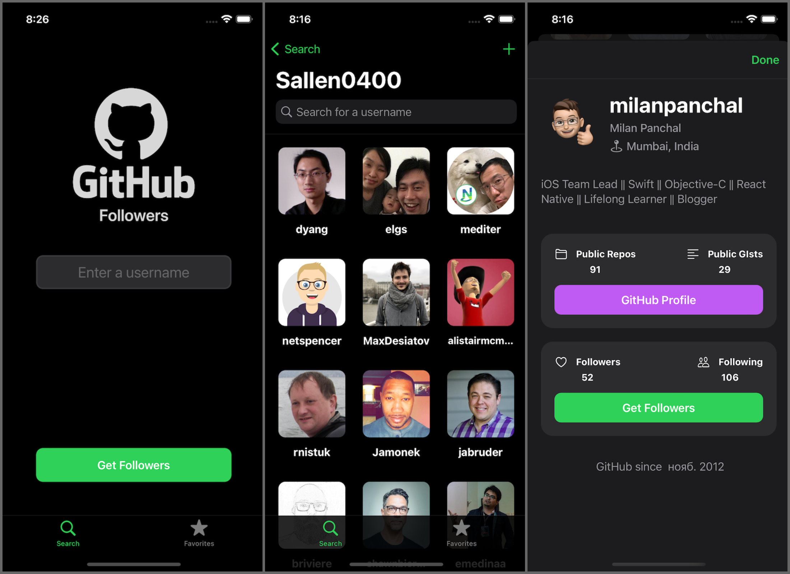

# GitHub Followers

iOS 13+ Sean Allen's UIKit take home project course. No 3-rd party libraries, GitHub API calling, JSON handling.

#### Views

- Programmatic views (No Storyboards)
- Collection view with pagination and Diffable Data Sources
- Embedded view controllers
- Native image caching with NSCache
- Custom alert view
- Native Dark Mode support
- Dynamic type
- iPhone SE support with ScrollView
- SafariVC
- Swipe to delete

#### Architecture

- Delegates and protocols
- Network manager with URLSession and Codable
- Persistence manager for UserDefaults
- Swift 5 result type and error handling
